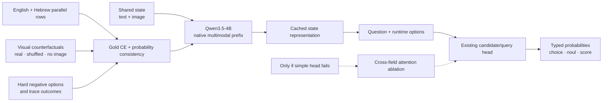

# Recommended Typical path

```mermaid
flowchart LR
    A[Shared state<br/>text + image] --> B[Qwen3.5-4B<br/>native multimodal prefix]
    B --> C[Cached state representation]
    C --> D[Question + runtime options]
    D --> E[Existing candidate/query head]
    E --> F[Typed probabilities<br/>choice · noul · score]

    G[English + Hebrew parallel rows] --> H[Gold CE + probability consistency]
    I[Visual counterfactuals<br/>real · shuffled · no image] --> H
    J[Hard negative options<br/>and trace outcomes] --> H
    H --> B

    K[Only if simple head fails] -.-> L[Cross-field attention ablation]
    L -.-> E
```
